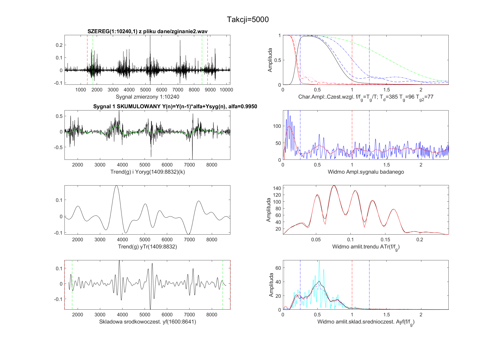
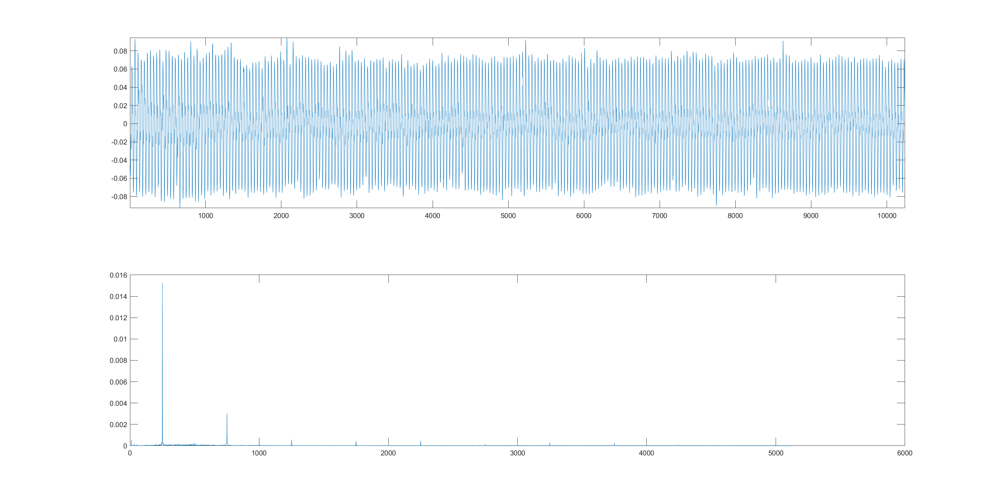
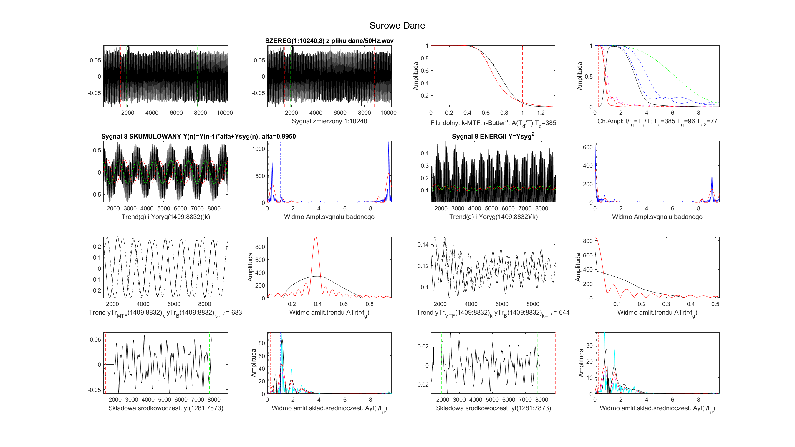

# Moving Trend Filters

### Design Butterworse
```matlab
function [bf, af, Amp, Phase, Wco, iT]=designButter(Tu,rzad,Lxf,fig,kolorB) 
% Tu - okres harmonicznej odcięcia
% rzad rzad filtru,
% Lxf rozmiar tablicy harmonicznych do obliczenia Bodego: xf=[0:Lxf-1],
% Wco indeks amplitudy polowy mocy Amp(Wco)=1/sqrt(2)
% iT ostatni indeks dla Amp(iT).0.09
```

 

> Czy w spektrum powinniśmy widzieć dwa piki?>
> 
>
> 