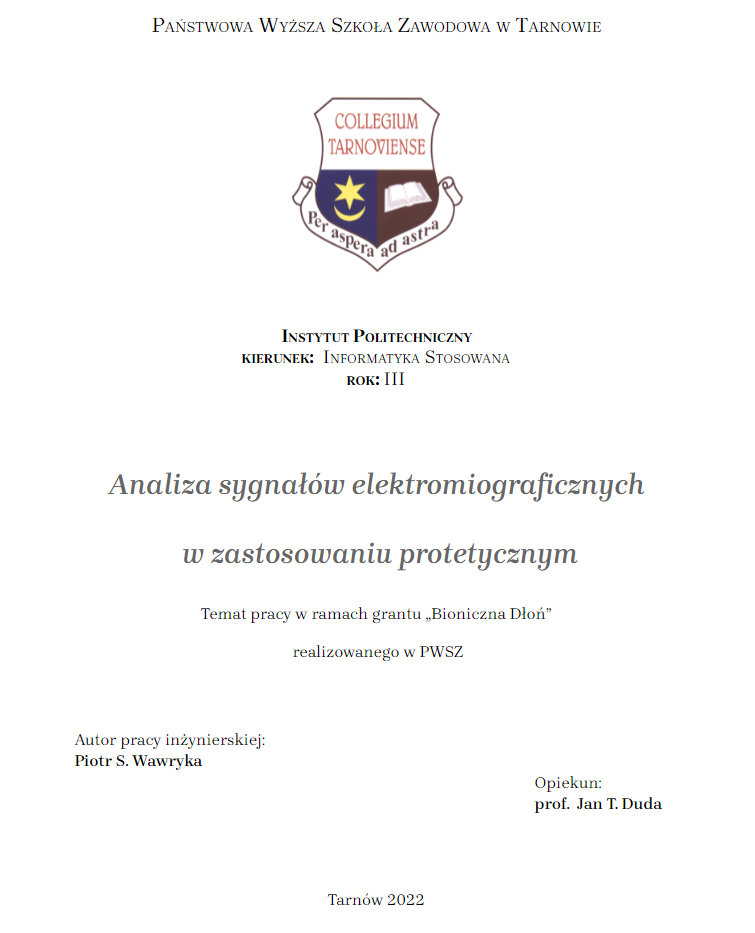
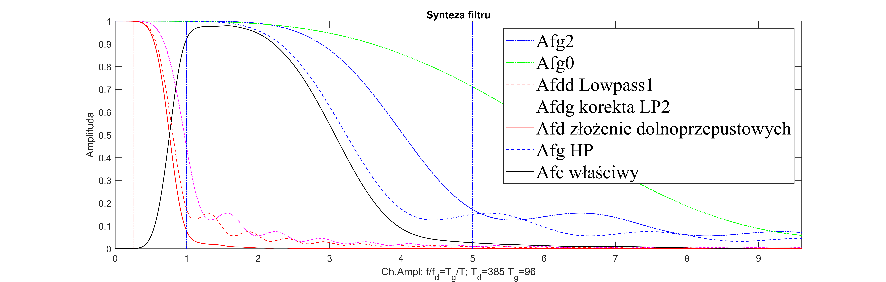
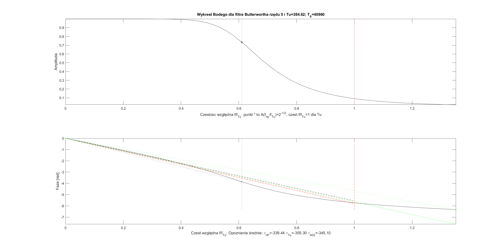
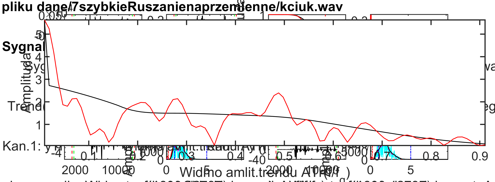

# Moving Trend Filters
[
     
](https://docs.google.com/document/d/17OcVbgB8YPnnKoOW4hjLjBLPRd0RgDVMCvWYHTweeac/edit?usp=sharing)

## Wprowadzenie

EMG to powierzchniowe (eng. surface) badanie bioelektrycznej aktywności mięśni.
https://docs.google.com/presentation/d/e/2PACX-1vRfEcfP52TywTPmVno2Bt6wgm4HaROeQChxWu-aj8LYmuvUH4RzDNxPejuuWYoAokfBrbt4SRoLLey4/pub?start=false&loop=false&delayms=3000
https://coggle.it/diagram/YbIUH-TqItosZrAC/t/-/47a919cd5319f9533d671f64049f234e41e9f24484d799b7f4371e7f052dabd4

https://pl.wikipedia.org/wiki/Jednostka_motoryczna
https://nba.uth.tmc.edu/neuroscience/m/s3/chapter01.html

### Materiały i metody

Eksperyment przeprowadzono z udziałem 109 osób. Do zapisu wykożystano format WAVE. Pojedynczy plik zawiera 8 kanałów nieskompresowanego sygnału EMG z próbkowanego 2048 razy na sekundę.
Do pomiaru przygotowano instukcję z animacją gestów. https://github.com/informacja/EMG/tree/master/matlab/instrukcja#readme
Proponowany przebieg nagrywania w 7-mio sekundowym oknie 5 sekund aktywności i 1-no sekundowe marginesy bezczynności (ze względu na sekcje początkową i kńcową filtra MTF).
Badany sygnał ma częstotliwość próbkowania 2048 na sekundę.

Konfiguracja aplikacji EMGAnalyzer transferującej sygnał użyteczny.
```cpp
#define DSIZE    4096
#define NCH 8
#define FS 2048
#define QLV_BYTES_PER_WORD 2   // uint16 // Quantisation LeVel, number of bytes per variable. Scale factor
#define DSIZE2   (DSIZE/QLV_BYTES_PER_WORD)

#define VSIZE (DSIZE2/NCH)      // Vector
#define SECONDS 7               // of recording
#define FRCNT NCH*SECONDS       // 8 chanels, 5 seconds

#define FFT_SIZE VSIZE*FRCNT
```

Progowanie
Zadanie
Bodźce
Wydajność behawioralna
ModelowanieSensor selection

Unbiased model
Model SNR

Obniżanie wagi kolejnych dowodów po jawnym wyborze
Dyskusja
Podziękowanie
<!-- 
 -->


### Synteza filtru MTF
> 
>Dolna granica filtru to 385 próbek (18 ms)
>Górna granica to        96 próbek  (4 ms)
>następnej równości nie jestem pewien, chodzi o stałą proporcję?
>f/fd = 96/2048

### Design Butterworse
```matlab
function [bf, af, Amp, Phase, Wco, iT]=designButter(Tu,rzad,Lxf,fig,kolorB) 
% Tu - okres harmonicznej odcięcia
% rzad rzad filtru,
% Lxf rozmiar tablicy harmonicznych do obliczenia Bodego: xf=[0:Lxf-1],
% Wco indeks amplitudy polowy mocy Amp(Wco)=1/sqrt(2)
% iT ostatni indeks dla Amp(iT).0.09
```

```matlab
designButter(Tud, 5, lT, 1)
```
 

## Praca z danymi

 

#### 50Hz
> Czy w spektrum powinniśmy widzieć dwa piki?
> 
> 
>
> 

> 
Dwojakie
 Działanie mięśnia 

Model mięśnia  czyli odwzorowanie sygnału użytecznego, czyli do jakiej krzywej pasuje 

Sygnał ma 40

kryt jakoścowe
szum na bieg jałowym

dopasowanie trendów 

Eksperymenty czy wzorzec jest trendem,
Batwors poszerza pasmo, szybciej opada
Tud jest umowne